 

 

 

 

 

<table>
<tr>
<td>

</td>
<td>

</td>
</tr>
</table>

 

 

&nbsp;&nbsp;

 

<picture>
  <source media="(prefers-color-scheme: dark)" srcset="https://raw.githubusercontent.com/singhtejpreet2004/singhtejpreet2004/output/github-contribution-grid-snake-dark.svg">
  <source media="(prefers-color-scheme: light)" srcset="https://raw.githubusercontent.com/singhtejpreet2004/singhtejpreet2004/output/github-contribution-grid-snake.svg">
  
</picture>

